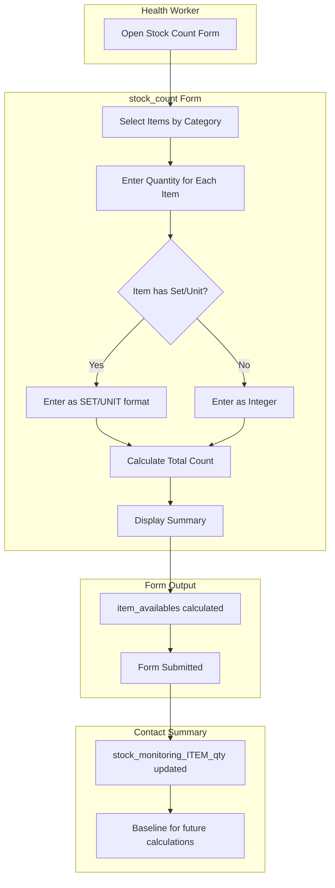
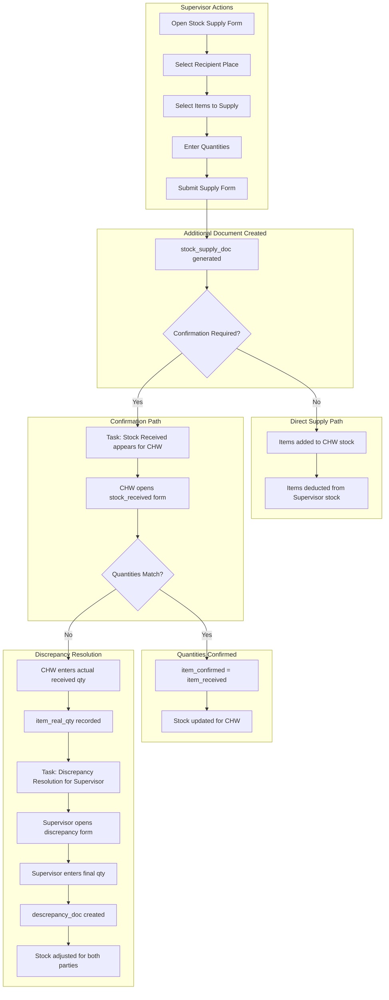
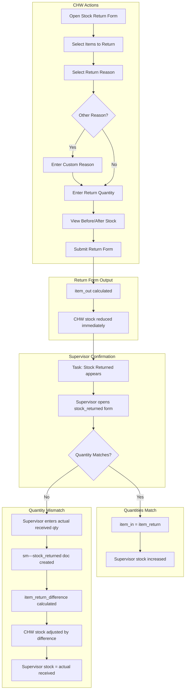
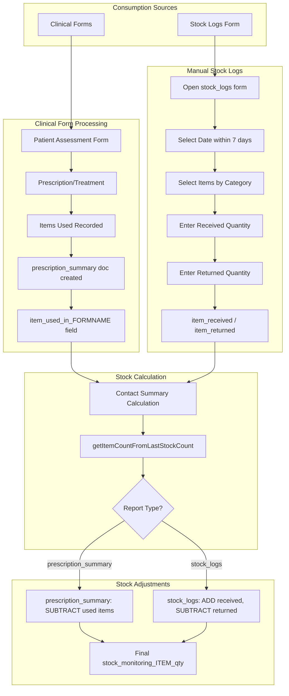
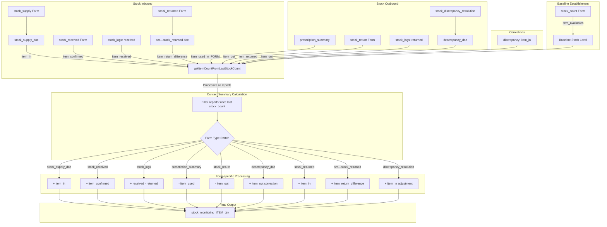
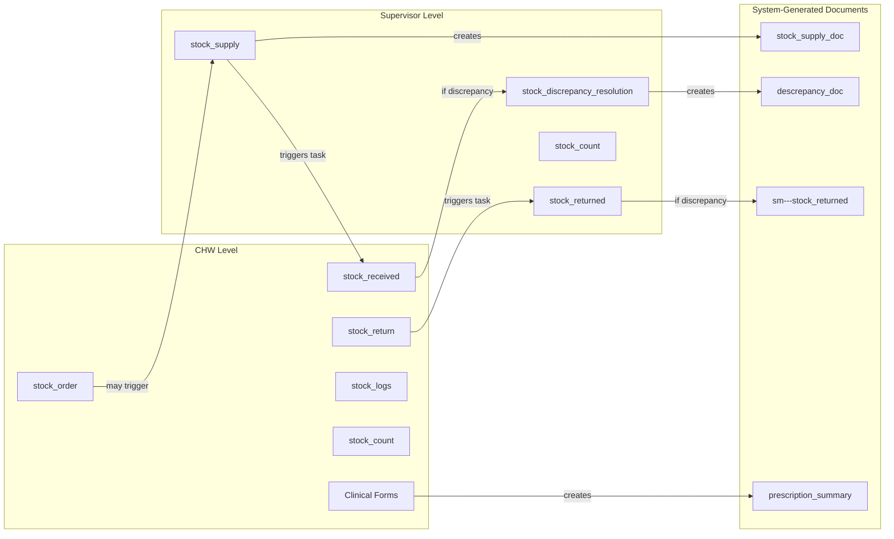

# CHT Stock Monitoring Workflow - Data Flow Diagrams

This document provides visual representations of how data flows through the CHT Stock Monitoring Workflow system. Each diagram illustrates a specific workflow or process within the stock management system.

## Table of Contents

1. [Stock Count Flow](#1-stock-count-flow)
2. [Stock Supply Flow](#2-stock-supply-flow)
3. [Stock Return Flow](#3-stock-return-flow)
4. [Consumption Flow](#4-consumption-flow)
5. [Overall Data Flow](#5-overall-data-flow)

---

## 1. Stock Count Flow

The Stock Count workflow allows health workers to record their current stock levels. This serves as the baseline for all subsequent stock calculations.



### Key Points

- Stock count can be triggered as an **action form** (manual) or as a **task** (scheduled)
- Supports categorization of items for easier navigation
- Items can be counted in sets (e.g., boxes) plus loose units
- The formula for set/unit items: `total = (sets * set_count) + units`
- Stock count values become the baseline (`item_availables`) for all subsequent calculations

---

## 2. Stock Supply Flow

The Stock Supply workflow handles the complete chain of issuing stock from a supervisor to a health worker, with optional confirmation and discrepancy resolution.



### Form Chain Details

| Step | Form Name | Actor | Output Field |
|------|-----------|-------|--------------|
| 1 | `stock_supply` | Supervisor | `item_supply` |
| 2 | `stock_supply_doc` | System | Additional doc with `item_in` |
| 3 | `stock_received` | CHW | `item_confirmed` |
| 4 | `stock_discrepancy_resolution` | Supervisor | `item_in` (adjustment) |
| 5 | `descrepancy_doc` | System | `item_out` (correction) |

### Stock Calculations

- **Supervisor stock**: Decreases by `item_supply` when supply is issued
- **CHW stock**: Increases by `item_confirmed` (if confirmation active) or `item_in` (if direct)
- **Discrepancy adjustment**: `item_out = item_received - item_confirmed`

---

## 3. Stock Return Flow

The Stock Return workflow handles items being returned from a health worker back to the supervisor, with confirmation of receipt.



### Return Reasons

The system supports predefined return reasons:
- Expired stock
- Damaged items
- Excess inventory
- Other (with free text)

### Stock Adjustments

| Scenario | CHW Stock | Supervisor Stock |
|----------|-----------|------------------|
| Return submitted | -`item_out` | No change yet |
| Confirmed (match) | No change | +`item_return` |
| Confirmed (mismatch) | +`item_return_difference` | +`item_received_qty` |

---

## 4. Consumption Flow

The Consumption flow tracks how stock items are used through clinical forms and manual logging.



### Clinical Form Integration

When clinical forms use stock items:
1. Form must include item usage fields
2. System creates `prescription_summary` additional document
3. Field format: `item_used_in_FORMNAME`
4. Items are automatically deducted from stock

### Stock Logs Form

The `stock_logs` form allows manual recording of:
- **Received items**: Items received outside the normal supply chain
- **Returned items**: Items returned or used outside clinical forms

Constraints:
- Date must be within the last 7 days
- Date cannot be in the future

---

## 5. Overall Data Flow

This comprehensive diagram shows how all forms and documents interact to maintain accurate stock levels in the contact-summary.



### Document Types Summary

| Document | Form Constant | Purpose | Effect on Stock |
|----------|--------------|---------|-----------------|
| `stock_supply_doc` | `SUPPLY_ADDITIONAL_DOC` | Records items supplied to CHW | +items (if no confirmation) |
| `prescription_summary` | `FORM_ADDITIONAL_DOC_NAME` | Records items used in clinical forms | -items |
| `descrepancy_doc` | `DISCREPANCY_ADD_DOC` | Records supply discrepancy adjustments | +/- correction |
| `sm---stock_returned` | `RETURNED_ADD_DOC` | Records return quantity differences | + difference back to CHW |

### Stock Calculation Algorithm

The `getItemCountFromLastStockCount` function in `common.js` performs the following:

1. **Find baseline**: Get the most recent `stock_count` report
2. **Filter reports**: Get all relevant reports since the stock count
3. **Process each report**: Apply form-specific calculations
4. **Aggregate**: Sum all additions and subtractions
5. **Output**: Final quantity stored as `stock_monitoring_ITEM_qty`

```
Final Stock = Baseline (stock_count)
            + Supplies received (stock_supply_doc, stock_received)
            + Stock logs received
            + Return differences (sm---stock_returned)
            + Discrepancy adjustments
            - Items used (prescription_summary)
            - Items returned (stock_return)
            - Stock logs returned
```

### Consumption Tracking

The `getItemsConsumption` function calculates item consumption over a period:

1. **Period**: Can be `week` or `month`
2. **Lookback**: Examines reports from the past 3 periods
3. **Sources counted**:
   - `prescription_summary`: Items used in clinical forms
   - `stock_supply`: Items supplied (adds to consumption tracking)
   - `discrepancy_resolution`: Adjustments (subtracts from consumption)
   - `stock_returned`: Items returned (subtracts from consumption)

---

## Form Relationships



---

## Configuration Dependencies

The workflows depend on configuration settings in the stock monitoring config:

| Feature | Config Path | Required For |
|---------|-------------|--------------|
| Stock Count | `features.stock_count` | Baseline establishment |
| Stock Supply | `features.stock_supply` | Item distribution |
| Supply Confirmation | `features.stock_supply.confirm_supply.active` | Two-step supply verification |
| Discrepancy Resolution | `features.stock_supply.discrepancy` | Supply mismatch handling |
| Stock Return | `features.stock_return` | Item return workflow |
| Return Confirmation | `features.stock_return.confirmation` | Return verification |
| Stock Logs | `features.stock_logs` | Manual consumption tracking |
| Stock Order | `features.stock_order` | Order request workflow |

---

## Notes

- All stock quantities are stored and calculated in base units
- Set/unit items are converted to base units using: `total = sets * set_count + units`
- The contact-summary recalculates stock on every report sync
- Historical reports are filtered based on the most recent stock count date
- All timestamps use the Luxon library for consistent date handling
